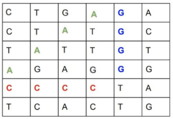

# simian-checker
API de análise de DNA humano/símio.

Este projeto tem por objetivo fornecer uma API capaz de avaliar amostras de DNA, determinando se a amostra pertence a um símio ou um humano.

As amostras seguem o seguinte padrão:



As amostras são analisadas contando a quantidade de sequências de 4 bases iguais(A, C, T e G), sejam horizontais, verticais ou diagonais.

Caso haja **mais de 1 sequência**, a amostra pertence a um símio, caso contrário é humana.

No exemplo acima, conforme as células destacadas, a amostra é **símia**.

A API disponibilizada possui 2 endpoints:

**POST /simian**

Que recebe no corpo da requisição a amostra, no seguinte padrão:

```
{
    "dna": [
        "CTGAGA",
        "CTATGC",
        "TATTGT",
        "AGAGGG",
        "CCCCTA",
        "TCACTG"
    ]
}
```

Caso a amostra avaliada seja símia, será retornado o status 200 - OK.
Se for humana, será retornado o status 403 - Forbidden.

**GET /stats**

Não exige nenhum parâmetro, e retorna dados estatísticos relativos as amostras já analisadas (*ratio* se refere a proporção de amostras símias em relação as humanas)

```
{
    "ratio": 1,
    "count_mutant_dna": 3,
    "count_human_dna": 3
}
``` 

### Solução técnica

O projeto foi desenvolvido em Java, utilizando a versão 8, em conjunto com [Spring Boot](https://spring.io/projects/spring-boot), [MongoDB](https://www.mongodb.com/), [Apache Kafka](https://kafka.apache.org/) e [Redis](https://redis.io/).

Os passos a seguir exigem a instalação e configuração prévias do **Java, Maven, Docker e Docker Compose**.

Para executar a aplicação em ambiente local é necessário subir o docker-compose com as depêndencias do projeto:

Na raiz do projeto
`docker-compose up`

É possível construir o pacote da aplicação através do comando
`mvn clean package`

E executar com
`java -jar target/simian-checker-0.0.1-SNAPSHOT.jar`

Também é possível executar o projeto através do plugin maven do Spring Boot
`mvn spring-boot:run`

Após o projeto subir, é possível acessar os endpoints com mais facilidade através do [Swagger UI](http://localhost:8080/swagger-ui.html)

O projeto está disponível também rodando na plataforma [Heroku](https://simian-checker.herokuapp.com/swagger-ui.html). Como a hospedagem é gratuita, pode ocorrer uma lentidão no primeiro acesso.